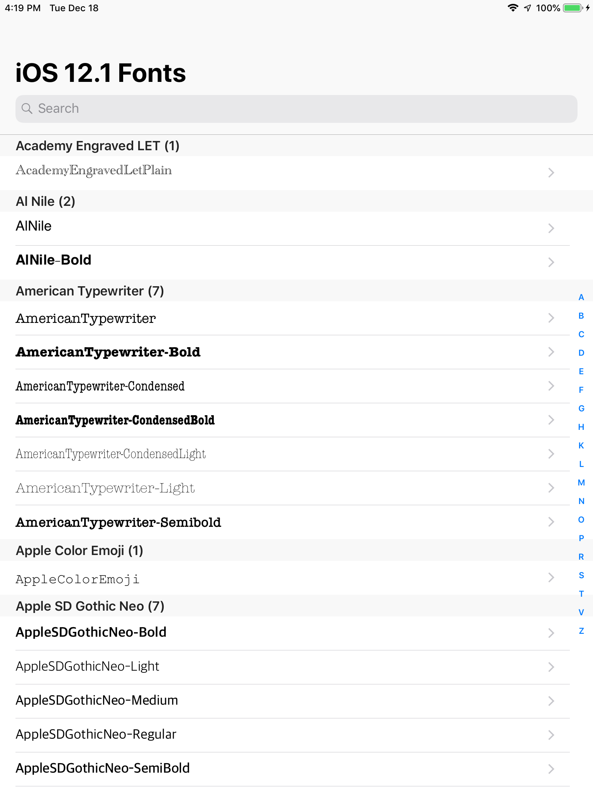
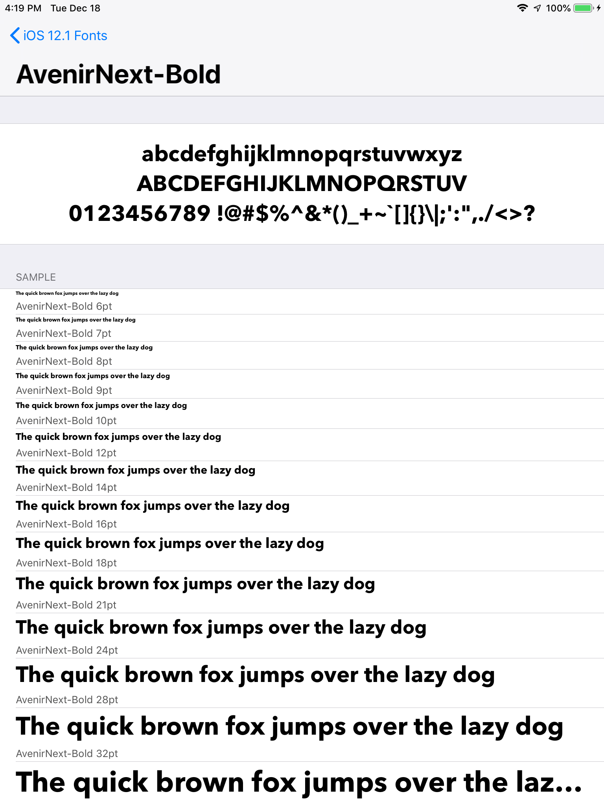
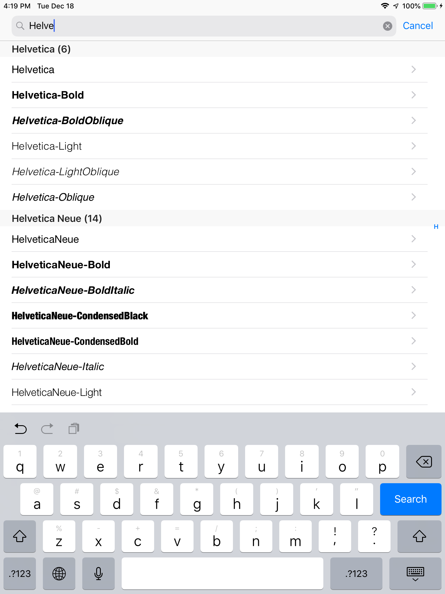

# Font Catalogue

    This work is licensed under a [Creative Commons Attribution-ShareAlike 4.0 International License](http://creativecommons.org/licenses/by-sa/4.0/).

## About

Toy app to list and display fonts available through the system.

## Screenshots

*The list view*

*The font sample view*

*The filtered list view*

## Reference
  * [UIFont](https://developer.apple.com/library/ios/documentation/UIKit/Reference/UIFont_Class/)
  * [UIFontDescriptor](https://developer.apple.com/library/ios/documentation/UIKit/Reference/UIFontDescriptor_Class/)